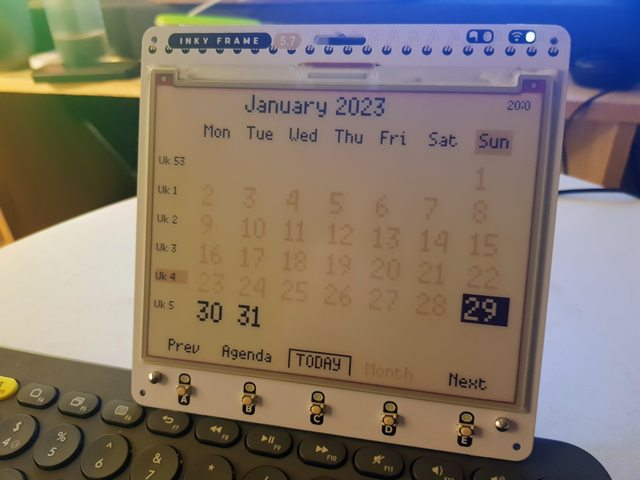

# Inky Frame 5.7" Calendar

Work in progress.

## Features

- [ ] Low power
- [ ] Navigate next/prev page
- [x] Agenda view
- [x] Month view
- [ ] Week view
- [ ] Load data from ICS URL
- [x] ISO Week

## Getting Started

1. Follow Pimoroni official instructions
2. Open _Thonny_
3. Load `lib/urllib/main.mpy`
4. Create `secrets.py`
5. Load `main.py`

